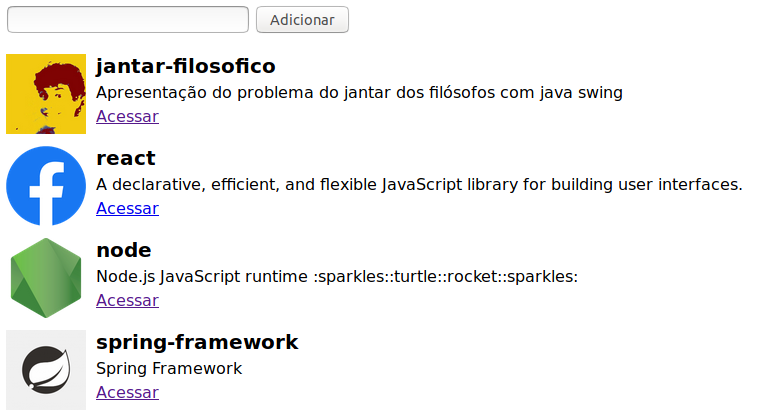

# Aprendendo ES6
- Node e Yarn
- Babel
- Classes
- Const e let
- Operações em array (map,reduce,filter,find)
- Arrow functions
- Valores padrão
- Desestruturação
- Operadores rest/spread
- Template literals
- Object short syntax
- Configuração do webpack
- Import/export
- Webpack dev server
- Axync/await
- Axios

# Apresentação
